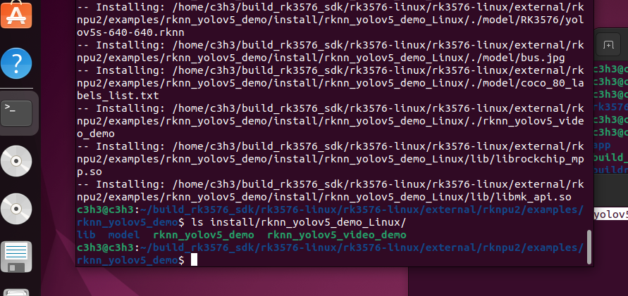
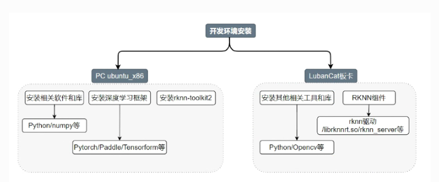
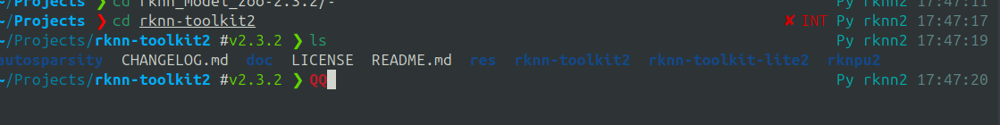

# kickpi 教程

源码路径
```bash
(SDK)/external/rknpu2/examples/rknn_yolov5_demo
```
工具链路径 

`(SDk)/prebuilts/gcc/linux-x86/aarch64/gcc-arm-10.3-2021.07-x86_64-aarch64-none-linux-gnu/`

```bash
(SDK)$ export TOOL_CHAIN=(SDK)/prebuilts/gcc/linux-x86/aarch64/gcc-arm-10.3-2021.07-x86_64-aarch64-none-linux-gnu/
(SDK)$ export GCC_COMPILER=(SDK)/prebuilts/gcc/linux-x86/aarch64/gcc-arm-10.3-2021.07-x86_64-aarch64-none-linux-gnu/bin/aarch64-none-linux-gnu
```

```bash
export TOOL_CHAIN=/home/c3h3/build_rk3576_sdk/rk3576-linux/rk3576-linux/prebuilts/gcc/linux-x86/aarch64/gcc-arm-10.3-2021.07-x86_64-aarch64-none-linux-gnu/

export GCC_COMPILER=/home/c3h3/build_rk3576_sdk/rk3576-linux/rk3576-linux/prebuilts/gcc/linux-x86/aarch64/gcc-arm-10.3-2021.07-x86_64-aarch64-none-linux-gnu/bin/aarch64-none-linux-gnu
```

编译结果

```bash
lib  model  rknn_yolov5_demo  rknn_yolov5_video_demo
```



# 训练开源教程

RKNN-Toolkit2：用于模型转换和性能分析

RKNN Runtime：用于在设备上运行推理

* https://doc.embedfire.com/linux/rk356x/Ai/zh/latest/lubancat_ai/example/yolov5.html
* https://docs.100ask.net/rockchip/docs/DshanPi-A1/part3/part3-3/03-3-1_SetupRKNNEnvironment#41-%E5%AE%89%E8%A3%85rknn-toolkit-lite2

* https://zhuanlan.zhihu.com/p/439927321

# rknn 部署

rk3576 rknn-tookit2 开发套件(Python接口)运行在PC平台（x86/arm64），提供了模型转换、 量化功能、模型推理、性能和内存评估、量化精度分析、模型加密等功能。

rknn 网址: 
* https://github.com/airockchip/rknn_model_zoo?tab=readme-ov-file

获取RKNN仓库
```bash
# 新建 Projects 文件夹
mkdir Projects 
cd Projects
# 下载 RKNN-Toolkit2 仓库
git clone -b v2.3.2 git@github.com:airockchip/rknn-toolkit2.git
# https://dl.100ask.net/Hardware/MPU/RK3576-DshanPi-A1/utils/rknn-toolkit2.zip

# 下载 RKNN Model Zoo 仓库
git clone -b v2.3.2 git@github.com:airockchip/rknn_model_zoo.git
# https://dl.100ask.net/Hardware/MPU/RK3576-DshanPi-A1/utils/rknn_model_zoo.zip
```



模型训练环境搭建
```bash
# PC ubuntu, 以下操作都在 ubuntu 64 机器执行
https://repo.anaconda.com/archive/Anaconda3-2023.07-2-Linux-x86_64.sh

# 开发板
wget -c https://repo.anaconda.com/archive/Anaconda3-2025.06-1-Linux-aarch64.sh
https://dl.100ask.net/Hardware/MPU/RK3576-DshanPi-A1/utils/Anaconda3-2025.06-1-Linux-aarch64.sh
# 启动安装脚本
bash Anaconda3-2025.06-1-Linux-aarch64.sh

# 执行脚本
./Anaconda3-2023.07-2-Linux-x86_64.sh
source ~/.bashrc
```

```bash
# 换源
# 查看默认的源
conda config --show channels
# 使用清华源，也可以自行添加其他第三方源等等
conda config --add channels https://mirrors.tuna.tsinghua.edu.cn/anaconda/pkgs/main
conda config --add channels https://mirrors.tuna.tsinghua.edu.cn/anaconda/pkgs/r
conda config --set custom_channels.auto https://mirrors.tuna.tsinghua.edu.cn/anaconda/cloud/
conda config --set show_channel_urls yes
```

|           常用命令           |     描述     |
| :--------------------------: | :----------: |
|   conda activate env-name    |   激活环境   |
|       conda deactivate       |   退出环境   |
|        conda env list        | 列出所有环境 |
| conda env remove -n env-name |   删除环境   |
|     conda list env-name      |  查看包列表  |

```bash
# 创建 conda 环境
conda create -n rknn2 -y
# 激活环境
conda activate rknn2

# 安装包
conda install python=3.9 -y

# 配置 pip 源
pip3 config set global.index-url https://pypi.tuna.tsinghua.edu.cn/simple/
```




根据 python 版本执行不同的 .whl, 还需要选择编译的机器架构 x86_64

```bash
#安装编译依赖
conda install compilers cmake

#安装RKNN依赖
pip3 install -r requirements_cp39-2.3.2.txt

# 安装rknn_toolkit2
pip3 install rknn_toolkit2-2.3.2-cp39-cp39-manylinux_2_17_x86_64.manylinux2014_x86_64.whl
```

验证安装是否成功
```bash
# 进入 Python 交互模式
python3
# 导入 RKNN 类
from rknn.api import RKNN
```


rknn 接口使用