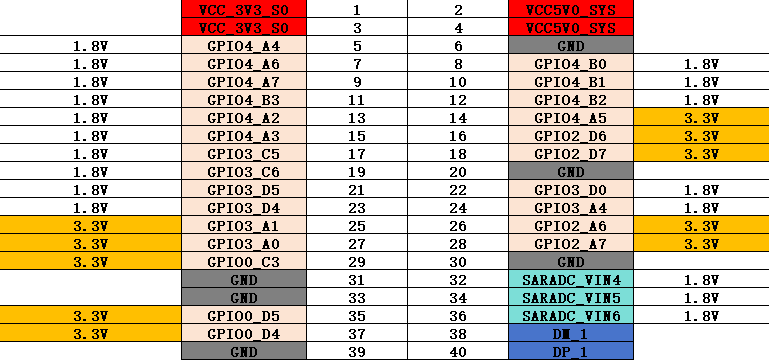

# K7C 引脚



# AM312 PIR 传感器

GPIO2_D6(94) - Y 引脚, 1 列 6 排(不算上前两行的VCC)
```bash
# export 使能
echo 94 > /sys/class/gpio/export
echo in > /sys/class/gpio/gpio94/direction
cat /sys/class/gpio/gpio94/value  # 读取传感器状态
```

```bash
# 需要先释放
echo 94 > /sys/class/gpio/unexport

# 监控引脚状态变化
gpiomon --rising-edge --falling-edge gpiochip2 30
event:  RISING EDGE offset: 30 timestamp: [    1078.928060579]
event:  RISING EDGE offset: 30 timestamp: [    1080.044972411]
event:  RISING EDGE offset: 30 timestamp: [    1080.045464443]
```

# A3144E 磁力磁性感应开关版

GPIO2_D7
```bash
echo 95 > /sys/class/gpio/export
echo in > /sys/class/gpio/gpio95/direction
cat /sys/class/gpio/gpio95/value  # 读取传感器状态
```

```bash
echo 95 > /sys/class/gpio/unexport
gpiomon --rising-edge --falling-edge gpiochip2 31
```

# 蜂鸣器

GPIO0_C3(19) - Y
```bash
echo 19 > /sys/class/gpio/export
echo out > /sys/class/gpio/gpio19/direction
echo 1 > /sys/class/gpio/gpio19/value   # 高
echo 0 > /sys/class/gpio/gpio19/value   # 低
```

# LED 灯带

GPIO4_A2(130) - Y
```bash
echo 130 > /sys/class/gpio/export
echo out > /sys/class/gpio/gpio130/direction
echo 1 > /sys/class/gpio/gpio130/value   # 高
echo 0 > /sys/class/gpio/gpio130/value   # 低
```

# BH1750 光照传感器

GPIO3_D5 - SDA  GPIO3_D4  - SCL

