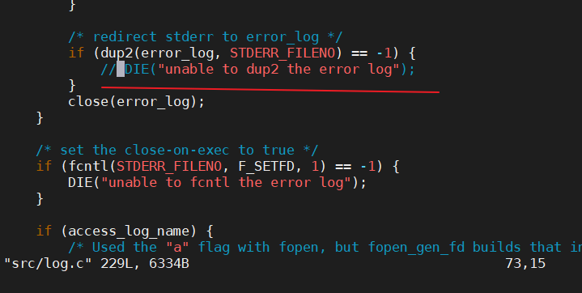
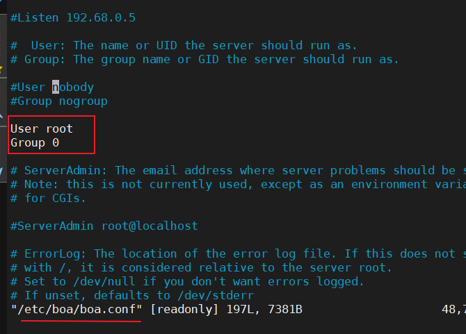
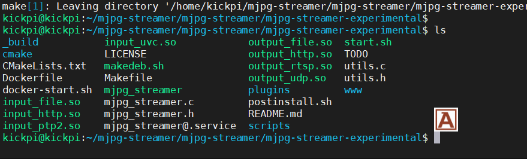

# Bor Web 部署

http://www.boa.org/documentation/

教程: 
* https://www.cnblogs.com/yikoulinux/p/15925379.html
* https://www.cnblogs.com/hnrainll/archive/2011/06/01/2067295.html
* https://juejin.cn/post/7500491627402281010

网址(关闭代理): http://www.boa.org/ 

从源码编译 Bor Web，部署到服务器
```shell
# 安装编译工具和基础库
sudo apt-get update
# sudo apt-get install -y gcc make libc6-dev flex bison
sudo apt-get install -y make libc6-dev flex bison
```

```shell
# 创建工作目录
mkdir -p ~/boa && cd ~/boa

# 从开源存档站点下载源码（稳定版本 0.94.13）
wget https://www.boa.org/boa-0.94.13.tar.gz  # 若失效，用备用地址：http://www.geocities.ws/yongtao_hu/boa/boa-0.94.13.tar.gz

# 解压
tar -zxvf boa-0.94.13.tar.gz
cd boa-0.94.13/src

./configure

# 31 CC = aarch64-linux-gnu-gcc
# 32 CPP = aarch64-linux-gnu-gcc -E

make
sudo mv boa /usr/local/sbin/


# boa 命令通常会被安装到 /usr/local/sbin/，所以需要加入 PATH
# 永久添加到 PATH
echo 'export PATH=$PATH:/usr/local/sbin' >> ~/.bashrc
source ~/.bashrc
```


<font color = Coral>依赖文件架构</font>

```
/var/www/ 
    index.html
    boa/
        cgi-bin/
        logs/
```


```shell
# 配置文件
sudo mkdir -p /etc/boa
sudo cp ~/boa/boa-0.94.13/boa.conf /etc/boa/

# 配置运行目录
sudo mkdir -p /var/www/boa/{cgi-bin,logs}
sudo chown -R $USER:$USER /var/www/boa

# 创建日志目录
sudo mkdir -p /var/log/boa
```

## 启动步骤

```bash
sudo boa -c /etc/boa/

# 查看端口占用
sudo ss -tuln | grep ':80'

# 本地测试
curl http://localhost:80
```

## 关闭步骤

```bash
sudo pkill boa
sudo pkill -f "boa -c /etc/boa" 

# 确认80端口已释放
sudo ss -tulpn | grep ':80' 
```

## 错误

```bash
log.c:73 - unable to dup2 the error log: Bad file descriptor
```
即src文件夹下把 `log.c` 中的第73行的if语句注释掉


---



```
User root
Group 0
```

---

显示空白页面


将 index.html 文件放到 /var/www/ 目录下即可, DocumentRoot 修改为 /var/www/

```bash
curl: (7) Failed to connect to localhost port 80 after 0 ms: Couldn't connect to server
```


# 摄像头选配

分辨率
方案 A（兼顾精度）：1280x720（16:9，接近 YOLO 输入比例，细节足够，处理压力中等）
方案 B（优先实时性）：640x480（4:3，与 YOLO 输入尺寸接近，缩放开销最小，性能最佳）

# mjpg-streamer 部署

```bash
sudo apt update
sudo apt install -y cmake libjpeg8-dev gcc g++
```

```bash
mkdir ~/mjpg-streamer && cd ~/mjpg-streamer
git clone https://github.com/jacksonliam/mjpg-streamer.git
cd mjpg-streamer/mjpg-streamer-experimental
make
sudo make install
```



```bash
cd /home/kickpi/mjpg-streamer/mjpg-streamer/mjpg-streamer-experimental
export LD_LIBRARY_PATH=.

./mjpg_streamer -i "./input_uvc.so -d /dev/video25 -r 1920x1080 -f 30" -o "./output_http.so -p 8090 -w ./www"

./mjpg_streamer -i "./input_uvc.so -d /dev/video42 -r 1920x1080 -f 30" -o "./output_http.so -p 8090 -w ./www"
# 在浏览器输入 http://127.0.0.1:8090/?action=stream

./mjpg_streamer -i "./input_uvc.so -d /dev/video25 -r 640x480 -f 30 -y" -o "./output_http.so -p 8090 -w ./www"
```


# 修复流程

curl: (52) Empty reply from server + 进程存在但无法访问 + 403 Forbidden

```bash
#!/bin/bash
set -e

sudo pkill -9 boa 2>/dev/null || true
sudo rm -rf /var/log/boa 2>/dev/null || true

if ! id boauser &>/dev/null; then
  sudo addgroup boauser 2>/dev/null || sudo groupadd boauser
  sudo adduser --system --no-create-home --ingroup boauser boauser 2>/dev/null || \
  sudo useradd -r -g boauser -s /usr/sbin/nologin boauser
fi

sudo tee /etc/boa/boa.conf > /dev/null <<'EOF'
Port 80
User boauser
Group boauser
DocumentRoot /var/www
DirectoryIndex index.html
ErrorLog /var/log/boa/error_log
AccessLog /var/log/boa/access_log
MimeTypes /etc/mime.types
DefaultType text/plain
KeepAliveMax 50
KeepAliveTimeout 5
# DISABLE ALL RISKY FEATURES
# DirectoryMaker /usr/lib/boa/boa_indexer
# ScriptAlias /cgi-bin/ /usr/lib/cgi-bin/
EOF

sudo mkdir -p /var/www /var/log/boa
sudo chown -R boauser:boauser /var/www /var/log/boa
sudo chmod 755 /var /var/www /var/log /var/log/boa
sudo chmod 644 /var/www/index.html 2>/dev/null || true

sudo touch /var/log/boa/{error_log,access_log}
sudo chown boauser:boauser /var/log/boa/*

sudo boa -c /etc/boa/ 2>&1 | tee /tmp/boa_debug.log &
sleep 2

echo "✅ 进程: $(ps aux | grep [b]oa || echo 'FAILED')"
echo "✅ 端口: $(ss -tuln | grep ':80' || echo 'FAILED')"
if curl -Is http://127.0.0.1/ | grep -q "200 OK"; then
  echo "✅ 状态: HTTP 200 OK (服务正常)"
else
  echo "❌ 诊断详情:"
  cat /tmp/boa_debug.log
  cat /var/log/boa/error_log 2>/dev/null || echo "无错误日志"
  exit 1
fi
```